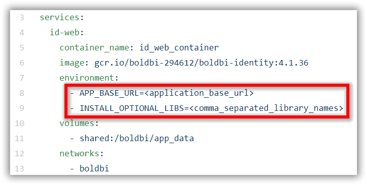

# Bold BI on Docker

Bold BI can be deployed using docker-compose. Nginx will be running in a separate container as reverse proxy to route traffic to other containers. Please follow the below steps to deploy Bold BI using docker-compose deployment.

Download the configuration files [here](deploy/). This directory includes docker-compose YML file and configuration file for nginx.

## docker-compose changes

1. Open **docker-compose.yml** file from the downloaded files. Replace your DNS or IP address on which you are going to access the application in `<application_base_url>` place.
    
    Ex: `http://example.com`, `https://example.com`, `http://<ip_address>`

2. Read the optional client library license agreement from the following link.

    [Consent to deploy client libraries](consent-to-deploy-client-libraries.md)

3. Note the optional client libraries from the above link as comma separated names and replace it in `<comma_separated_library_names>` place. Save the file after the required values has been replaced.

 

4. Provide **default.conf** file path in `<default_conf_path>` place.

    Ex: `"./default.conf:/etc/nginx/conf.d/default.conf"`
        `"D:/boldbi/docker/default.conf:/etc/nginx/conf.d/default.conf"`
        `"/var/boldbi/docker/default.conf:/etc/nginx/conf.d/default.conf"`

5. Allocate a directory in your host machine to store the shared folders for applications’ usage. Replace the directory path with `<host_path>` in **docker-compose.yml** file.

    Ex: `device: 'D:/boldbi/shared'`
        `device: '/var/boldbi/shared'`

## Configure SSL
If you have an SSL certificate for your domain and need to configure the site with your SSL certificate, follow these steps or you can skip this.

1. Uncomment the following marked lines in the Nginx config file.

    

2. Comment the following marked line in the Nginx config file.

    

3. Replace the example.com with your domain name.

4. Define the path of the SSL certificate: `ssl_certificate /etc/ssl/domain.crt`

5. Specify the directory where the SSL certificate key is located: `ssl_certificate_key /etc/ssl/domain.key`

> **NOTE:** If you are configuring the application with SSL, you need update the `<application_base_url>` in the **docker-compose.yml** with `HTTPS`.


## Deploy Bold BI using docker-compose

1. Run the **docker-compose.yml** file using the following docker command.

```sh
docker-compose up
```

2. Wait till you see the applications in running state. Then, use your DNS or IP address to access the application in the browser.

24.	Configure the Bold BI On-Premise application startup to use the application. Please refer the following link for more details on configuring the application startup.
    
    https://help.boldbi.com/embedded-bi/application-startup
