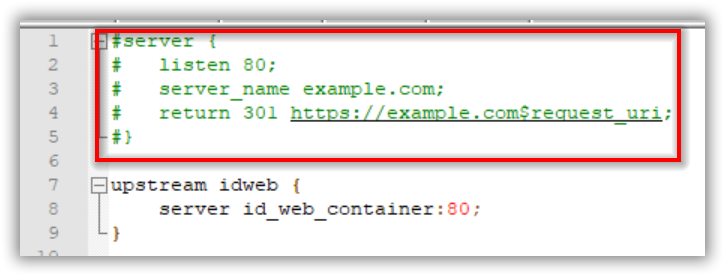
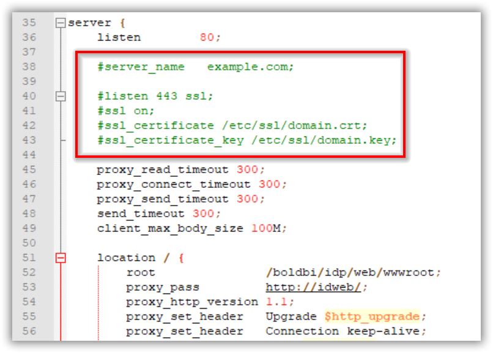
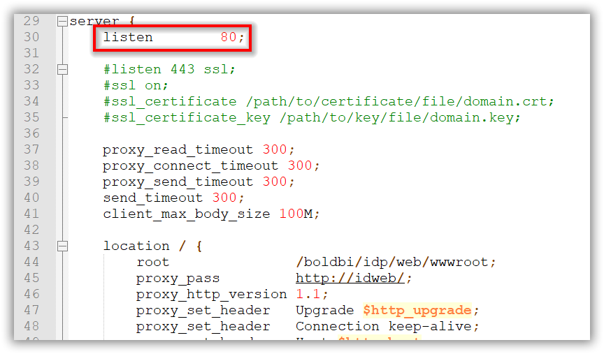

# Quick reference

* Maintained by: [Bold BI by Syncfusion](https://www.boldbi.com)

* Where to get help: [Bold BI Documentation](https://www.boldbi.com/documentation)

* Where to file issues: https://www.syncfusion.com/support/directtrac/incidents/newincident

# Supported tags and respective `Dockerfile` links

* [4.1.36](https://github.com/boldbi/boldbi-docker/blob/v4.1.36/dockerfile)


# What is Bold BI?

Bold BI is a powerful business intelligence dashboard software that helps you get meaningful insights from your business data and make better decisions.

It is an end-to-end solution for creating, managing, and sharing interactive business dashboards that includes a powerful dashboard designer for composing easily.

# How to use this image

## Start a Bold BI instance

```sh
docker run --name boldbi -p 80:80 -e APP_URL=<app_base_url> -d syncfusion/boldbi:<tag>
```

Replace `<app_base_url>` with your DNS or IP address, by which you want to access the application.
    
For example, <br/>
    `http://example.com` <br/>
    `https://example.com` <br/>
    `http://<public_ip_address>` <br/>
    `http://host.docker.internal` <br/>


Note:
* If you are using the IP address for the Base URL, make sure you are using the public IP of the machine instead of internal IP or local IP address. Applications can communicate with each other through public IP alone. Host machine IP will not be accessible inside the application container.

* Use http://host.docker.internal instead of http://localhost. Host machine localhost DNS will not be accessible inside the container. So docker desktop provides `host.docker.internal` & `gateway.docker.internal` DNS for communication between docker applications and host machine. Please make sure that the host.docker.internal DNS has your IPv4 address mapped in your host config file (C:\Windows\System32\drivers\etc\hosts).

* Make sure you provide the HTTP or HTTPS scheme for APP_BASE_URL value.


## Advanced configuration


```sh
docker run --name boldbi -p 80:80 -p 443:443 \
     -e APP_URL=<app_base_url> \
     -e OPTIONAL_LIBS=<optional_library_names> \
     -v <host_path_for_appdata_files>:/boldbi/app_data \
     -v <host_path_for_nginx_config>:/etc/nginx/sites-available \
     -d syncfusion/boldbi:<tag>
```

### Consent to deploy client libraries

By giving consent to install client libraries to connect with Oracle, PostgreSQL, MySQL, MongoDB, InfluxDB, and Snowflake.Data, you can use the following libraries in your docker container. Bold BI uses these client libraries to connect with their respective SQL database variants. Read about the licenses of each library to give consent for usage. 

<br/>

| Library                   | DLLs           | License       | Name         |
| -------------             | ------------- | ------------- |------------- |
| mongo-csharp-driver       | MongoDB       | [Apache License, Version 2.0](https://github.com/mongodb/mongo-csharp-driver/blob/master/License.txt) | mongodb |
| Snowflake.Data            | Snowflake.Data| [Apache License, Version 2.0](https://github.com/snowflakedb/snowflake-connector-net/blob/master/LICENSE) | snowflake |
| Oracle.ManagedDataAccess  | Oracle        | [Oracle License](https://www.oracle.com/downloads/licenses/distribution-license.html) | oracle |
| Npgsql 4.0.0              | PostgreSQL <br/> Amazon Redshift <br/>Google Cloud - PostgreSQL <br/> Amazon Aurora - PostgreSQL | [PostgreSQL License](https://github.com/npgsql/npgsql/blob/main/LICENSE) | npgsql        |
| MySQLConnector 0.45.1     | MySQL <br/> MemSQL <br/> MariaDB <br/> Google Cloud – MySQL <br/> Amazon Aurora - MySQL <br/> CDATA | [MIT License](https://github.com/mysql-net/MySqlConnector/blob/master/LICENSE) | mysql         |
| InfluxData.Net            | InfluxDB | [MIT License](https://github.com/pootzko/InfluxData.Net/blob/master/LICENSE) | influxdb      |
| [PhantomJS WebKit](https://phantomjs.org)          | phantomjs | [License](https://github.com/ariya/phantomjs/blob/master/LICENSE.BSD) and [Third-Party](https://github.com/ariya/phantomjs/blob/master/third-party.txt) documents. | phantomjs     |


Find the names of client libraries in the last column of the above table, which needs to be passed as a comma-separated string for the `OPTIONAL_LIBS` environment variable in place of `<optional_library_names>` on the docker run command.
<br/><br/>

If you want to use all client libraries in the Bold BI application, then pass the following string as a value for the `OPTIONAL_LIBS` environment variable. You need to add the names only for the libraries, which you are consenting to use with the Bold BI application.
<br/><br/>
`phantomjs,mongodb,mysql,influxdb,snowflake,oracle,npgsql`


### Persisting application data

You can store the application data in your host machine to make the Bold BI container a stateful application. Existing containers can be deleted and new ones can be created with the host machine directory attached to the container. Then Bold BI application will read and write the data in your host machine.

Replace the `<host_path_for_appdata_files>` value with a directory path from your host machine in the advanced docker run command.

For example,<br/>
Windows: `-v D:/boldbi/app_data:/boldbi/app_data`<br/>
Linux: `-v /home/boldbi/app_data:/boldbi/app_data`
<br/><br/>

### Nginx configuration

You can mount a host directory to Bold BI container for maintaining Nginx configuration. You can also store SSL certificates in this directory and can configure nginx with them.

Replace the `<host_path_for_nginx_config>` value with a directory path from your host machine in the advanced docker run command.

For example,<br/>
Windows: `-v D:/boldbi/nginx:/etc/nginx/sites-available`<br/>
Linux: `-v /home/boldbi/nginx:/etc/nginx/sites-available`

Once the Bold BI container started to run, you can check the directory in your host machine. The `boldbi-nginx-config` file will be generated there. You can configure the Nginx inside the container using this file.


### SSL configuration in Nginx

If you have an SSL certificate for your domain and need to configure the site with your SSL certificate, follow the below steps.

1. Uncomment the following marked lines in the **boldbi-nginx-config** file.

    

    

2. Comment the following marked line in the **boldbi-nginx-config** file.

    

3. Replace the example.com with your domain name.

4. Place the certificate and key file in your host directory which you mounted on the Bold BI application to store Nginx configuration. i.e. The directory path replaced with `<host_path_for_nginx_config>` value in the advanced docker run command. You can update the certificate and key file names in **boldbi-nginx-config** file.

    

> **NOTE:** If you are configuring the application with SSL, then you need to update the `<app_base_url>` in docker run command with `HTTPS`.


### Example for Advanced docker run command

```sh
docker run --name boldbi -p 80:80 -p 443:443 \
     -e APP_URL=https://example.com \
     -e OPTIONAL_LIBS=phantomjs,mongodb,mysql,influxdb,snowflake,oracle,npgsql \
     -v D:/boldbi/app_data:/boldbi/app_data \
     -v D:/boldbi/nginx:/etc/nginx/sites-available \
     -d syncfusion/boldbi:4.1.36
```
