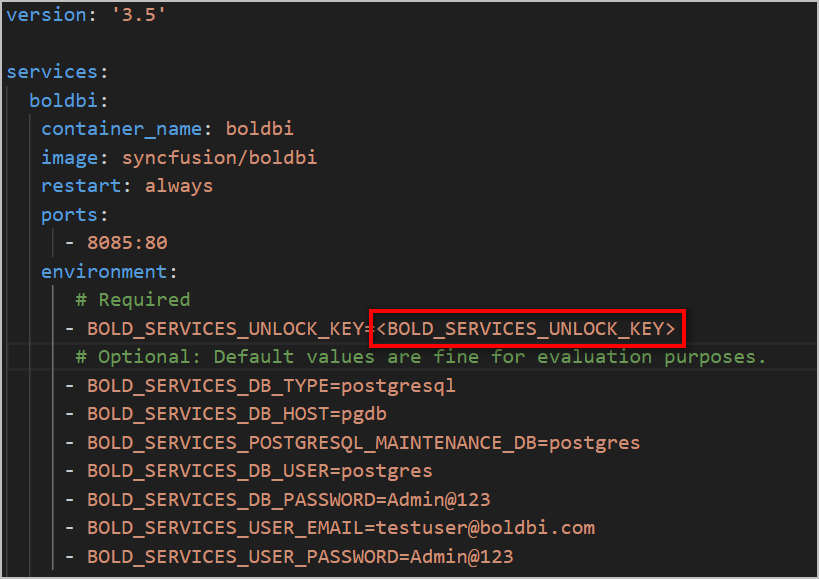
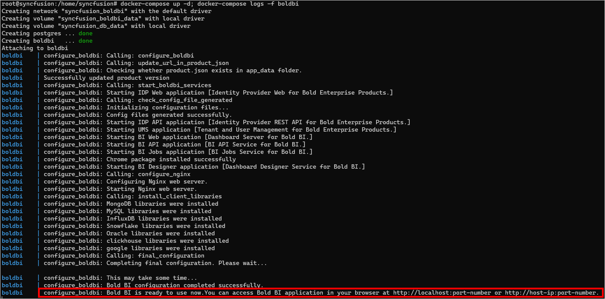

<a href="https://www.boldbi.com"></a>
<br/>
<br/>

[](https://github.com/boldbi/boldbi-docker/releases/latest)
[](https://help.boldbi.com/embedded-bi)
[](https://www.boldbi.com/support)

# What is Bold BI

Bold BI is a powerful business intelligence dashboard software that helps you to get meaningful insights from your business data and make better decisions.

It is an end-to-end solution for creating, managing, and sharing interactive business dashboards that include a powerful dashboard designer for composing easily.

With deep embedding, you can interact more with your data and get insights directly from your application.

# Deployment Prerequisites

### Hardware requirements

The following hardware requirements are necessary to run the Bold BI solution:

* Operating System: You can use the Bold BI Docker on the following operating systems: 
  * Windows
  * Linux
  * Mac
* CPU: 2-core.
* Memory: 4 GB RAM.
* Disk Space: 8 GB or more.

### Software requirements

The following software requirements are necessary to run the Bold BI Enterprise edition:

* Database: Microsoft SQL Server 2012+ | PostgreSQL | MySQL
* Application: [Docker](https://docs.docker.com/engine/) and [Docker Compose](https://docs.docker.com/compose/) 
* Web Browser: Microsoft Edge, Mozilla Firefox, and Chrome

# Supported tags

| Tags               | OS Version    | Last Modified(MM/DD/YYYY)|
| -------------      | ------------- | ------------- |
| `6.8.9`, `latest` | Debian 10  (amd64,arm64)    | 07/05/2023 |
| `6.8.9-alpine`    | Alpine 3.13  (amd64)  | 07/05/2023 |
| `6.8.9-focal`     | Ubuntu 20.04  (amd64)       | 07/05/2023 |
|`6.8.9-arm64`      | Debian 10 (arm64)|07/05/2023

# How to use this image

The above Bold BI image can be deployed using Docker or Docker Compose. In the following section, we are going to starts the BoldBI and a separate PostgreSQL instance with volume mounts for data persistence.

### Using Docker Compose 

1. Download docker compose file using the below command.
   ```sh
   curl -o docker-compose.yml "https://raw.githubusercontent.com/Vinoth-Krishnamoorthy/boldbi-docker/main/deploy/single-container/docker-compose.yml"
   ```
2. Open the docker compose file and fill the mandatory fields - <b>APP_URL</b> and <b>Unlock Key</b>.

    

      ##### **APP_URL Guidance:**
      * Provide the HTTP scheme for APP_URL value.
      For example, <br/>
          `http://example.com` <br/>
          `http://<public_ip_address>` <br/>
      * For Windows and MacOS use either http://host.docker.internal or http://localhost. Docker Desktop provides `host.docker.internal` and `gateway.docker.internal` DNS for communication between docker applications and host machine. Please make sure that the host.docker.internal DNS has your IPv4 address mapped in your hosts file on Windows(C:\Windows\System32\drivers\etc\hosts).
      * For Linux use the Machine Public IP address as the value for APP_URL with the HTTP scheme.

4. Run docker compose up command.
   ```sh
   docker-compose up -d
   ```
   
5. After running the command, you can access the Bold BI App by entering APP_URL in a browser.
   

### Using Docker 

1. Run the below command to run Postgres SQL container.
   ```sh
   docker run --name postgres -e POSTGRES_PASSWORD=Admin@123 -p 5433:5432 -v postgres_data:/var/lib/postgresql/data/ -d postgres
   ```
2. Run the below command to run Bold BI after replacing mandatory fields App_URL and Unlock Key.
   ```sh
   docker run --name boldbi -p 8085:80 -p 443:443 \
      -e APP_URL=<APP_URL> \   
      -e BOLD_SERVICES_UNLOCK_KEY=<Bold_BI_license_key>  \
      -e BOLD_SERVICES_DB_TYPE=postgresql  \
      -e BOLD_SERVICES_DB_HOST=host.docker.internal \
      -e BOLD_SERVICES_DB_PORT=5433 \
      -e BOLD_SERVICES_DB_USER=postgres \
      -e BOLD_SERVICES_DB_PASSWORD=Admin@123 \
      -e BOLD_SERVICES_POSTGRESQL_MAINTENANCE_DB=postgres \
      -e BOLD_SERVICES_USER_EMAIL=adminuser@boldbi.com \
      -e BOLD_SERVICES_USER_PASSWORD=Admin@123 \ 
      -v boldbi_data:/application/app_data \
      -v nginx_data:/etc/nginx/sites-available \
      -d syncfusion/boldbi
   ```
   * Refer [this](https://help.boldbi.com/faq/how-to-get-offline-unlock-key/) document to get Bold BI unlock key.
   You need to pass the same credentials that you passed in the first command as arugument here. 

   * Refer [this](#app_url-guidance) steps for APP_URL guidance.

4. After running the command, you can access the Bold BI App by entering APP_URL in a browser.
   
# How to deploy Bold BI using advanced configuration

In this section, we will learn how to run the Bold BI application using advanced configurations such as persistence volume, environment variables, manually configuring the startup of Bold BI, and running multiple containers for Bold BI.

## Persistent Volume

Volumes are the preferred way to persist data in Docker containers and services. While bind mounts are dependent on the directory structure and OS of the host machine, volumes are completely managed by Docker.

```sh
docker run --name boldbi -p 80:80 -p 443:443 \
     -e APP_URL=https://example.com \
     -e OPTIONAL_LIBS=mongodb,mysql,influxdb,snowflake,oracle,clickhouse,google \
     -e widget_bing_map_enable=true\
     -e widget_bing_map_api_key=<widget_bing_map_api_key> \
     -e AppSettings__CustomSizePDFExport=false \
     -e AppSettings__BrowserTimezone=false \
     -v <host_path_for_appdata_files>:/application/app_data \
     -v <host_path_for_nginx_config>:/etc/nginx/sites-available \
     -d syncfusion/boldbi:6.8.9
``` 

### Persisting application data

You can store the application data in your host machine to make the Bold BI container a stateful application. Bold BI application will read and write the data in your host machine.
 
Replace the `<host_path_for_appdata_files>` value with a directory path from your host machine in the advanced docker run command.

> **For example**<br/>
> Windows: `-v D:/boldbi/app_data:/application/app_data`<br/>
> Linux: `-v /home/boldbi/app_data:/application/app_data`

### Nginx configuration

You can mount a host directory to the Bold BI container for maintaining the Nginx configuration. You can also store SSL certificates in this directory and can configure Nginx with them.

Replace the `<host_path_for_nginx_config>` value with a directory path from your host machine in the advanced docker run command.

> **For example**<br/>
> Windows: `-v D:/boldbi/nginx:/etc/nginx/sites-available`<br/>
> Linux: `-v /home/boldbi/nginx:/etc/nginx/sites-available`

Once, the Bold BI container started to run, you can check the directory in your host machine. The `boldbi-nginx-config` file will be generated there. You can configure the Nginx inside the container using this file.

## Environment Variable

Bold BI accepts the following environment variables from the command line.

| Name                          |Required| Description   | 
| -------------                 |----------| ------------- | 
| `APP_URL`                     |No <br /><br /><br /> Needed when configuring with domain or IP| Domain or IP address with http/https protocol.<br/>For example, <br/>`http://<public_DNS_address>`<br/>`http://<public_ip_address>` <br/><br/>The default APP_URL is `http://localhost`<br/><br/> <b>Note:</b><br/>•	If you are using the IP address for the Base URL, make sure you are using the public IP of the machine instead of internal IP or local IP address. Applications can communicate with each other using the public IP alone. Host machine IP will not be accessible inside the application container.<br/>• For linux depoyment the default APP_URL is http://localhost or http://172.17.0.1<br/>• You can provide the HTTP or HTTPS scheme for APP_BASE_URL value.<br/>• Please refer to this section for [SSL Termination](docs/ssl-termination.md).|
|`OPTIONAL_LIBS`|No|	These are the client libraries used in Bold BI by default.<br/><br/>`'mongodb,mysql,influxdb,snowflake,oracle,clickhouse,google'`<br/><br/>Please refer [Consent to deploy client libraries](docs/consent-to-deploy-client-libraries.md) Libraries section to know more.|
| `widget_bing_map_enable`      |No| If you need to use Bing Map widget feature, enable this to `true`.<br/>By default this feature will be set to `false`. | 
| `widget_bing_map_api_key`     |No| API key value for the Bing Map. |
| `AppSettings__CustomSizePDFExport`|No|To utilize a customized page size for A4 PDF export, set this feature to `true`. By default, this feature is set to `false`.|
| `AppSettings__BrowserTimezone`|No|If you need to use Browser time zone feature , enable this to `true`. By default this feature will be set to `false`.|
|`<host_path_for_appdata_files>` |No|Persistent volume path for Bold BI application data|
|`<host_path_for_nginx_config>` |No|Persistent volume path for Nginx configuration|

<br/>

## Environment variables for configuring `Application Startup` in backend

The below Environment variables are optional. If not provided a manual Application Startup configuration is needed.

| Name                          |Required| Description   | 
| -------------                 |----------| ------------- |
|`BOLD_SERVICES_UNLOCK_KEY`|Yes|License key for activating the Bold BI. Please refer to [this document](https://help.boldbi.com/embedded-bi/faq/how-to-get-offline-unlock-key/) to download the key. <br/> If you don't have the download key option, please create a support ticket [here](https://support.boldbi.com/create). |
|`BOLD_SERVICES_DB_TYPE`|Yes|Type of database server can be used for configuring the Bold BI.<br/><br />The following DB types are accepted:<br />1. mssql – Microsoft SQL Server/Azure SQL Database<br />2. postgresql – PostgreSQL Server<br />3. mysql – MySQL/MariaDB Server|
|`BOLD_SERVICES_DB_HOST`|Yes|Name of the Database Server|
|`BOLD_SERVICES_DB_PORT`|No|The system will use the following default port numbers based on the database server type.<br />PostgrSQL – 5234<br />MySQL -3306<br /><br />Please specify the port number for your database server if it is configured on a different port.<br /><br />For MS SQL Server, this parameter is not necessary.|
|`BOLD_SERVICES_DB_USER`|Yes|Username for the database server<br /><br />Please refer to [this documentation](https://help.boldbi.com/embedded-bi/faq/what-are-the-database-permissions-required-to-set-up-bold-bi-embedded/) for information on the user's permissions.|
|`BOLD_SERVICES_DB_PASSWORD`|Yes|The database user's password|
|`BOLD_SERVICES_DB_NAME`|No|If the database name is not specified, the system will create a new database called bold services.<br /><br />If you specify a database name, it should already exist on the server.|
|`BOLD_SERVICES_POSTGRESQL_MAINTENANCE_DB`|Yes|For PostgreSQL DB Servers, this is an optional parameter.<br />The system will use the database name `postgres` by default.<br />If your database server uses a different default database, please provide it here.|
|`BOLD_SERVICES_DB_ADDITIONAL_PARAMETERS`|No|If your database server requires additional connection string parameters, include them here.<br /><br />Connection string parameters can be found in the official document.<br />My SQL: https://dev.mysql.com/doc/connector-net/en/connector-net-8-0-connection-options.html<br />PostgreSQL: https://www.npgsql.org/doc/connection-string-parameters.html<br />MS SQL: https://docs.microsoft.com/en-us/dotnet/api/system.data.sqlclient.sqlconnection.connectionstring<br /><br /><b>Note:</b> A semicolon(;) should be used to separate multiple parameters.|
|`BOLD_SERVICES_USER_EMAIL`|Yes|It should be a valid email.|
|`BOLD_SERVICES_USER_PASSWORD`|Yes|It should meet our password requirements.<br /> <br />**Note:** <br />Password must meet the following requirements. It must contain,At least 6 characters, 1 uppercase character, 1 lowercase character, 1 numeric character, 1 special character |

### Environment variables for configuring `Branding` in backend
The following environment variables are optional. If they are not provided, Bold BI will use the default configured values.

<table>
   <tr>
      <td>
       <b>Name</b>
      </td>
      <td>
       <b>Description</b>
      </td>
    </tr>
    <tr>
      <td>
       BOLD_SERVICES_BRANDING_MAIN_LOGO
      </td>
      <td>   
       This is the header logo for the application, and the preferred image size is 40 x 40 pixels.
      </td>
    </tr>
    <tr>
      <td>
       BOLD_SERVICES_BRANDING_LOGIN_LOGO
      </td>
      <td>     
       This is the login logo for the application, and the preferred image size is 200 x 40 pixels.
      </td>
    </tr>
    <tr>
      <td>
       BOLD_SERVICES_BRANDING_EMAIL_LOGO
      </td>
      <td>     
       This is an email logo, and the preferred image size is 200 x 40 pixels.
      </td>
    </tr>
    <tr>
      <td>
       BOLD_SERVICES_BRANDING_FAVICON
      </td>
      <td>     
       This is a favicon, and the preferred image size is 40 x 40 pixels. 
      </td>
    </tr>
    <tr>
      <td>
       BOLD_SERVICES_BRANDING_FOOTER_LOGO
      </td>
      <td>     
       This is powered by the logo, and the preferred size is 100 x 25 pixels.
       <br />
       <br />
       <b>Note:</b><br/>• All branding variables are accepted as URL.<br/>• <b>Ex:</b> https://example.com/loginlogo.jpg.<br/>• <b>Image type:</b> png, svg, jpg, jpeg.<br/>• If you want to use custom branding, provide the value for all branding variables. If all variable values are given, the application will use the branding images, otherwise, it will take the default logos. 
      </td>
    </tr>
    <tr>
      <td>
       BOLD_SERVICES_SITE_NAME
      </td>
      <td>
      This is organization name.     
      <br />
       If the value is not given, the site will be deployed using the default name.
      </td>
    </tr>
    <tr>
      <td>
       BOLD_SERVICES_SITE_IDENTIFIER
      </td>
      <td>     
       This is site identifier, and it will be the part of the application URL.
      <br />
      If the value is not given, the site will be deployed using the default value.
      </td>
    </tr>
</table>
<br/>

## Application Startup

Bold BI application startup can be configured manually if you don't wish to configure application startup automatically. Please refer to the following link, for more details on configuring the application startup.

https://help.boldbi.com/embedded-bi/application-startup

## Start multiple containers Bold BI with `docker-compose`

Bold BI also comes with multiple images for each of the services in it to run on docker-compose, which is mainly for the production environment to scale services within Bold BI. Please refer to [this guide](docs/multiple-container.md) to get to know about the multiple images and compose details to deploy Bold BI in an advanced docker-compose environment.

# License

https://www.boldbi.com/terms-of-use#embedded<br />

The images are provided for your convenience and may contain other software that is licensed differently (Linux system, Bash, etc. from the base distribution, along with any direct or indirect dependencies of the Bold BI platform).

These pre-built images are provided for convenience and include all optional and additional libraries by default. These libraries may be subject to different licenses than the Bold BI product.

If you want to install Bold BI from scratch and precisely control which optional libraries are installed, please download the stand-alone product from boldbi.com. If you have any questions, please contact the Bold BI team (https://www.boldbi.com/support).

It is the image user's responsibility to ensure that any use of this image complies with any relevant licenses for all software contained within.

# FAQ

[How to configure SSL for Bold BI application in single container and multiple container?](https://github.com/boldbi/boldbi-docker/blob/main/docs/FAQ/how-to-configure-ssl-for-docker-compose.md)

[How to reset the database for Bold BI application in docker environment?](https://github.com/boldbi/boldbi-docker/blob/main/docs/FAQ/how-to-configure-ssl-for-docker-compose.md)

[How to auto deploy multiple services Bold BI via docker-compose?](https://github.com/boldbi/boldbi-docker/blob/main/docs/FAQ/how-to-auto-deploy-bold-bi-multiple-services-in-docker-compose.md)


