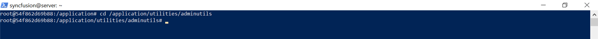
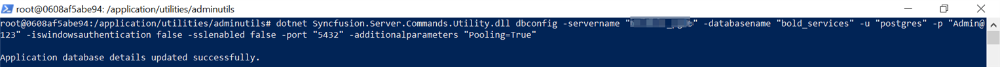

# How to reset the database for Bold BI application in docker environment.

This section explain how to reset the application database of Bold BI server application through the command line interface.

* [Single image deployment](#single-container-deployment)
* [Multiple image deployment](#multi-container-deployment)

## Single container deployment

1. Open the command prompt and Bash the container then change the directory to the admin utility location.
   ~~~
   docker exec -it <Container ID or Container name>
   ~~~
   ~~~
   cd /application/utilities/adminutils/
   ~~~   
   
2. After changing the directory, run the following command to reset the database.  
   ~~~
   dotnet Syncfusion.Server.Commands.Utility.dll dbconfig -servername "localhost" -databasename "BoldBIMasterDatabase" -u "Admin" -p "Admin@12345" -iswindowsauthentication false -sslenabled false -port "5432" -additionalparameters "Pooling=True"   
   ~~~  
   
3. Once, the database has been updated successfully, then restart the application by using below command

   ~~~
   docker restart <container ID or container name>
   ~~~
## Multi container deployment

1. Open the command prompt and Bash the <b>id_web_container</b> container then change the directory to the admin utility location.
   ~~~
   docker exec -it <Container ID or Container name>
   ~~~
   ~~~
   cd /application/utilities/adminutils/
   ~~~   
   
2. After changing the directory, run the following command to reset the database.  
   ~~~
   dotnet Syncfusion.Server.Commands.Utility.dll dbconfig -servername "localhost" -databasename "BoldBIMasterDatabase" -u "Admin" -p "Admin@12345" -iswindowsauthentication false -sslenabled false -port "5432" -additionalparameters "Pooling=True"   
   ~~~  

   > **IMPORTANT:**  command details:  
servername – SQL server hostname/IP  
databasename – SQL database name  
u – SQL server username  
p – SQL server password  
port - Port number required for PostgreSQL and MySQL  
iswindowsauthentication – Is windows authentication required (Required for MSSQL only)  
sslenabled – Is encrypted connection required (this is optional)  
additionalparameters - Additional parameters required for database connection (this is optional)  

   

3. Once, the database has been updated successfully, then restart all container by using below command

   ~~~
   docker ps 
   ~~~

   ~~~
   docker restart <container ID or container name>
   ~~~

   >**Note**: Restart all seven container using above command one by one from container name or ID.