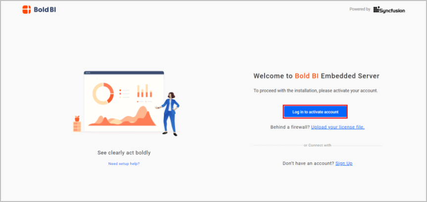

 # How to deploy Bold BI and configure startup manually?

In the following section, we will deploy a single container Bold BI application using Docker Compose and manually configure the application startup.

**Bold BI Deployment:**

1. Download docker compose file using the following command.
   
   ```sh
   curl -o docker-compose.yml "https://raw.githubusercontent.com/boldbi/boldbi-docker/main/deploy/single-container/docker-compose.yml"
   ``` 
2. Run docker compose up command.
   
   ```sh
   docker-compose up -d
   ```
    
   

      > **Note:**
      > The docker volumes `boldbi_data` persists data of Bold BI. [Learn more about docker volumes](https://docs.docker.com/storage/volumes/)
      
3. Now, access the Bold BI application by entering the URL as `http://localhost:8085` or `http://host-ip:8085` in the browser. When opening this URL in the browser, it will display the License page within a few seconds. The default port number mentioned in the compose file is 8085. If you are making changes to the port number, then you need to use that port number for accessing the Bold BI application.
      

      > **Note:** Don't use localhost IP (`http://127.0.0.1`) with `port` to access the application.
      
**Application Startup**

Configure the Bold BI On-Premise application startup to use the application. Please refer the following link for more details on configuring the application startup.

https://help.boldbi.com/embedded-bi/application-startup

**Shutdown and Cleanup**

The command `docker-compose down` removes the containers and default network, but preserves the volumes of Bold BI and PostgreSQL. <br /><br />
The command `docker-compose down --volumes` removes the containers, default network, and all the volumes.
