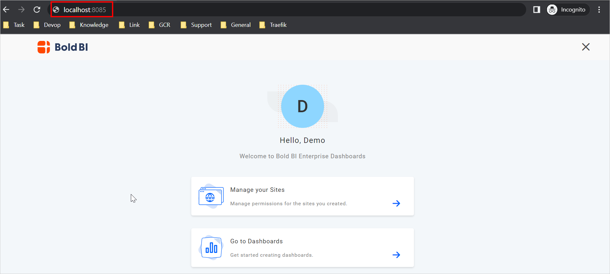

 # How to deploy Bold BI using existing DB server?

In the following section, we are going to run the Bold BI application by passing the application startup backend configuration environment variable using the existing DB server details.

1. Download docker compose file using the following command.
   
   ```sh
   curl -o docker-compose.yml "https://raw.githubusercontent.com/boldbi/boldbi-docker/main/deploy/single-container-with-env-variable/docker-compose.yml"
   ```
3. Open the docker compose file and fill the mandatory fields - <b>Unlock Key</b> and <b>Database details</b>

    


   <b>Environment variable Usage:</b>


    | Name                          |Required| Description   | 
   | -------------                 |----------| ------------- |
   |`BOLD_SERVICES_UNLOCK_KEY`|Yes|License key for activating Bold BI. Please download the offline Bold BI unlock key from the [downloads](https://www.boldbi.com/account) page. <br/> If you don't have the download key option, please create a support ticket [here](https://support.boldbi.com/create). |
   |`BOLD_SERVICES_DB_TYPE`|Yes|Type of database server can be used for configuring Bold BI.<br/><br />The following DB types are accepted:<br />1. mssql – Microsoft SQL Server/Azure SQL Database<br />2. postgresql – PostgreSQL Server<br />3. mysql – MySQL/MariaDB Server|
   |`BOLD_SERVICES_DB_HOST`|Yes|Name of the Database Server|
   |`BOLD_SERVICES_DB_PORT`|No|The system will use the following default port numbers based on the database server type.<br />PostgrSQL – 5234<br />MySQL -3306<br /><br />Please specify the port number for your database server if it is configured on a different port.<br /><br />For MS SQL Server, this parameter is not necessary.|
   |`BOLD_SERVICES_DB_USER`|Yes|Username for the database server<br /><br />Please refer to [this documentation](https://help.boldbi.com/embedded-bi/faq/what-are-the-database-permissions-required-to-set-up-bold-bi-embedded/) for information on the user's permissions.|
   |`BOLD_SERVICES_DB_PASSWORD`|Yes|The database user's password|
   |`BOLD_SERVICES_DB_NAME`|No|If the database name is not specified, the system will create a new database called bold services.<br /><br />If you specify a database name, it should already exist on the server.|
   |`BOLD_SERVICES_POSTGRESQL_MAINTENANCE_DB`|Yes|For PostgreSQL DB Servers, this is an optional parameter.<br />The system will use the database name `postgres` by default.<br />If your database server uses a different default database, please provide it here.|
   |`BOLD_SERVICES_DB_ADDITIONAL_PARAMETERS`|No|If your database server requires additional connection string parameters, include them here.<br /><br />Connection string parameters can be found in the official document.<br />My SQL: https://dev.mysql.com/doc/connector-net/en/connector-net-8-0-connection-options.html<br />PostgreSQL: https://www.npgsql.org/doc/connection-string-parameters.html<br />MS SQL: https://docs.microsoft.com/en-us/dotnet/api/system.data.sqlclient.sqlconnection.connectionstring<br /><br /><b>Note:</b> A semicolon(;) should be used to separate multiple parameters.|
   |`BOLD_SERVICES_USER_EMAIL`|Yes|It should be a valid email.|
   |`BOLD_SERVICES_USER_PASSWORD`|Yes|It should meet our password requirements.<br /> <br />**Note:** <br />Password must meet the following requirements. It must contain at least 6 characters, 1 uppercase character, 1 lowercase character, 1 numeric character, 1 special character |
4. Run docker compose up command.
   
   ```sh
   docker-compose up -d
   ```
   
   

      > **Note:**
      > The docker volumes `boldservices_data` persists data of Bold BI. [Learn more about docker volumes](https://docs.docker.com/storage/volumes/)
      
5. Now, access the Bold BI application by entering the URL as `http://localhost:8085` or `http://host-ip:8085` in the browser. When opening this URL in the browser, it will configure the application startup in the background and display the page below within a few seconds. The default port number mentioned in the compose file is 8085. If you are making changes to the port number, then you need to use that port number for accessing the Bold BI application.
   
   

      > **Note:** <br> 1. The deployment steps above are recommended for evaluation purposes only. For a production use case, you will need to mount the volume to the host path location or online storage and utilize managed DB servers. <br>2. Don't use localhost IP (`http://127.0.0.1`) with `port` to access the application.

**Shutdown and Cleanup**

The command `docker-compose down` removes the containers and default network, but preserves the volumes of Bold BI and PostgreSQL. <br /><br />
The command `docker-compose down --volumes` removes the containers, default network, and all the volumes.


