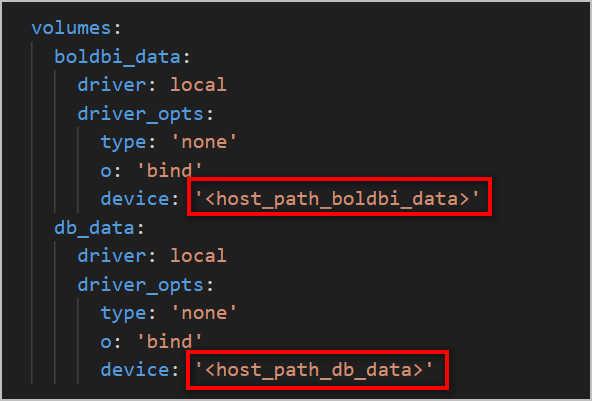

# How to use host path as persistent volume for Bold BI deployment?

You can store the application data on your host machine to make the Bold BI container a stateful application. The Bold BI application will read and write the data on your host machine. In the following section, we will learn how to use the host path as a persistent volume for Bold BI deployment.

## Run single container `Bold BI` via `docker-compose`

 This quick-start guide demonstrates how to use Compose to set up and run Bold BI. Before starting, make sure you have installed [Compose](https://docs.docker.com/compose/install/)

### Define the Project

1. Download the Docker Compose file by using the following command.
   
   ```sh
   curl -o docker-compose.yml "https://raw.githubusercontent.com/boldbi/boldbi-docker/main/deploy/single-container-with-host-path/docker-compose.yml"
   ```
2. Open the Docker Compose file, fill the BOLD_SERVICES_UNLOCK_KEY value, and save it. You can download the offline Bold BI unlock key from the [downloads](https://www.boldbi.com/account) page.

   

3. Allocate a directory in your host machine to store the shared folders for applications’ usage. Replace the directory path with `<host_path_boldbi_data>` and `<host_path_db_data>` in **docker-compose.yml** file.

   For example, <br><b>Windows:</b> `device: 'D:/boldbi/boldbi_data'` and `device: 'D:/boldbi/db_data'` <br><b>Linux:</b> `device: '/var/boldbi/boldbi_data'` and `device: '/var/boldbi/db_data'`
   
      
      > **Note:**
      > The docker volumes `boldbi_data` and `db_data` persists data of Bold BI and PostgreSQL respectively. [Learn more about docker volumes](https://docs.docker.com/storage/volumes/)

3. Run the command below. This command will start the Bold BI and Postgres SQL containers and display the Bold BI logs to provide information about the installation status of the Bold BI application.
   
   ```sh
   docker-compose up -d; docker-compose logs -f boldbi
   ```
   

4. Now, access the Bold BI application by entering the URL as `http://localhost:8085` or `http://host-ip:8085` in the browser. When opening this URL in the browser, it will configure the application startup in the background and display the page below within a few seconds. The default port number mentioned in the compose file is 8085. If you are making changes to the port number, then you need to use that port number for accessing the Bold BI application.
   
   

   > Note: Don't use `http://127.0.0.1` with `port` to access the application.


### Application Startup

Configure the Bold BI On-Premise application startup to use the application. Please refer the following link for more details on configuring the application startup.

https://help.boldbi.com/embedded-bi/application-startup

> **Note:**
> To use the above configured PostgreSQL server in Bold BI please use `pgdb` as the PostgreSQL server name.

### Shutdown and cleanup

The command `docker-compose down` removes the containers and default network, but preserves the volumes of Bold BI and PostgreSQL. <br /><br />
The command `docker-compose down --volumes` removes the containers, default network, and all the volumes.

