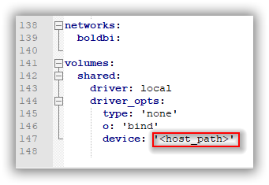

## Run multiple services `Bold BI` via `docker-compose`

This quick-start guide demonstrates how to use Compose to set up and run Bold BI. Before starting, make sure you have [Compose installed](https://docs.docker.com/compose/install/)

### Define the Project

  1. Create an empty project directory.<br/>
  You can name the directory something easy for you to remember. This directory is the context for your application image. This project directory should contains a `docker-compose.yml` file which is complete in itself for a good starter BoldBI project.

  2. Download the configuration files [here](/deploy/multiple-container/). This directory includes docker-compose YML file and configuration file for Nginx.
  
  > **Tip:**
    You can use either a `.yml` or `.yaml` extension for this file. They both works well.
  
  3.  Change into your project directory.<br/>
  For example, if you named your directory `my_boldbi`:

  ```sh
   $  cd my_boldbi/
   ```

  4. Create a docker-compose.yml file that starts your `BoldBI`  and a separate `PostgreSQL` instance with volume mounts for data persistence:

```sh
version: '3.5'

services:
  id-web:
    container_name: id_web_container
    image: gcr.io/boldbi-294612/bold-identity:4.2.69
    restart: on-failure
    # environment:
      # - APP_BASE_URL= <app_base_url>
      # - INSTALL_OPTIONAL_LIBS= phantomjs,mongodb,mysql,influxdb,snowflake,oracle,npgsql
    volumes: 
      - boldservices_data:/application/app_data
    networks:
      - boldservices
    healthcheck:
        test: ["CMD", "curl", "-f", "http://localhost/health-check"]
        interval: 10s
        timeout: 10s
        retries: 5
        
  id-api:
    container_name: id_api_container
    image: gcr.io/boldbi-294612/bold-identity-api:4.2.69
    restart: on-failure
    volumes: 
      - boldservices_data:/application/app_data
    networks:
      - boldservices
    depends_on:
      - id-web
    healthcheck:
        test: ["CMD", "curl", "-f", "http://localhost/health-check"]
        interval: 10s
        timeout: 10s
        retries: 5
        
  id-ums:
    container_name: id_ums_container
    image: gcr.io/boldbi-294612/bold-ums:4.2.69
    restart: on-failure
    volumes: 
      - boldservices_data:/application/app_data
    networks:
      - boldservices
    depends_on:
      - id-web
    healthcheck:
        test: ["CMD", "curl", "-f", "http://localhost/health-check"]
        interval: 10s
        timeout: 10s
        retries: 5
        
  bi-web:
    container_name: bi_web_container
    image: gcr.io/boldbi-294612/boldbi-server:4.2.69
    restart: on-failure
    volumes: 
      - boldservices_data:/application/app_data
    networks:
      - boldservices
    depends_on:
      - id-web
    healthcheck:
        test: ["CMD", "curl", "-f", "http://localhost/health-check"]
        interval: 10s
        timeout: 10s
        retries: 5
        
  bi-api:
    container_name: bi_api_container
    image: gcr.io/boldbi-294612/boldbi-server-api:4.2.69
    restart: on-failure
    volumes: 
      - boldservices_data:/application/app_data
    networks:
      - boldservices
    depends_on:
      - id-web
      - bi-web
    healthcheck:
        test: ["CMD", "curl", "-f", "http://localhost/health-check"]
        interval: 10s
        timeout: 10s
        retries: 5
      
  bi-jobs:
    container_name: bi_jobs_container
    image: gcr.io/boldbi-294612/boldbi-server-jobs:4.2.69
    restart: on-failure
    volumes: 
      - boldservices_data:/application/app_data
    networks:
      - boldservices
    depends_on:
      - id-web
      - bi-web
    healthcheck:
        test: ["CMD", "curl", "-f", "http://localhost/health-check"]
        interval: 10s
        timeout: 10s
        retries: 5
      
  bi-dataservice:
    container_name: bi_dataservice_container
    image: gcr.io/boldbi-294612/boldbi-designer:4.2.69
    restart: on-failure
    environment:
      - widget_bing_map_enable=""
      - widget_bing_map_api_key=""
    volumes: 
      - boldservices_data:/application/app_data
    networks:
      - boldservices
    depends_on:
      - id-web
      - bi-web
    healthcheck:
        test: ["CMD", "curl", "-f", "http://localhost/health-check"]
        interval: 10s
        timeout: 10s
        retries: 5
        
  reverse-proxy:
    container_name: nginx
    image: nginx
    restart: on-failure
    volumes:
      -  "<default_conf_path>:/etc/nginx/conf.d/default.conf"
      # - "<ssl_cert_file_path>:/etc/ssl/domain.crt"
      # - "<ssl_key_file_path>:/etc/ssl/domain.key"
    ports:
      - "8085:80"
      # - "443:443"
    environment:
      - NGINX_PORT=80
    networks:
      - boldservices
    depends_on:
      - id-web
      - id-api
      - id-ums
      - bi-web
      - bi-api
      - bi-jobs
      - bi-dataservice
  db:
    image: postgres
    restart: always
    environment:
      POSTGRES_PASSWORD: <Password>
    volumes:
      - db_data:/var/lib/postgresql
    networks:
      - boldservices

networks:
  boldservices:
  
volumes:
  boldservices_data:
    driver: local
    driver_opts:
      type: 'none'
      o: 'bind'
      device: '<host_path_boldservices_data>'
  db_data:
    driver: local
    driver_opts:
      type: 'none'
      o: 'bind'
      device: '<host_path_db_data>'
  ```
  5. Provide the **default.conf** file path, which you have downloaded earlier in `<default_conf_path>` place.

       <b>For example</b> <br>`"./default.conf:/etc/nginx/conf.d/default.conf"`<br>
        `"D:/boldbi/docker/default.conf":"/etc/nginx/conf.d/default.conf"`<br>
        `"/var/boldbi/docker/default.conf:/etc/nginx/conf.d/default.conf"`

     

  6. Allocate a directory in your host machine to store the shared folders for applications’ usage. Replace the directory path with `<host_path_boldservices_data>` and `<host_path_db_data>` in **docker-compose.yml** file.

       <b>For example</b> <br><b>Windows:</b> `device: 'D:/boldbi/boldservices_data'` and `device: 'D:/boldbi/db_data'` <br><b>Linux:</b> `device: '/var/boldbi/boldservices_data'` and `device: '/var/boldbi/db_data'`

      

> **Note:**
> The docker volumes `boldservices_data` and `db_data` persists data of Bold BI and PostgreSQL respectively. [Learn more about docker volumes](https://docs.docker.com/storage/volumes/)

### Build the project

Now, run `docker-compose up -d` from your project directory.
<br />

This runs `docker-compose up` in detached mode, pulls the needed Docker images, and starts the boldbi and database containers, as shown in the example below.

### Bring up BoldBI in a web browser

At this point, BoldBI should be running in http://localhost:8085 or http://host-ip:8085 (as appropriate)

> **Note:**
> The BoldBI site is not immediately available on port 8085 because the containers are still being initialized and may take a couple of minutes before the first load.

### Application Startup

Configure the Bold BI On-Premise application startup to use the application. Please refer the following link for more details on configuring the application startup.

https://help.boldbi.com/embedded-bi/application-startup

> **Note:**
> To use the above configured PostgreSQL server in Bold BI please use `pgdb` as the PostgreSQL server name.

### Shutdown and cleanup

The command `docker-compose down` removes the containers and default network, but preserves the volumes of Bold BI and PostgreSQL. <br /><br />
The command `docker-compose down --volumes` removes the containers, default network, and all the volumes.

