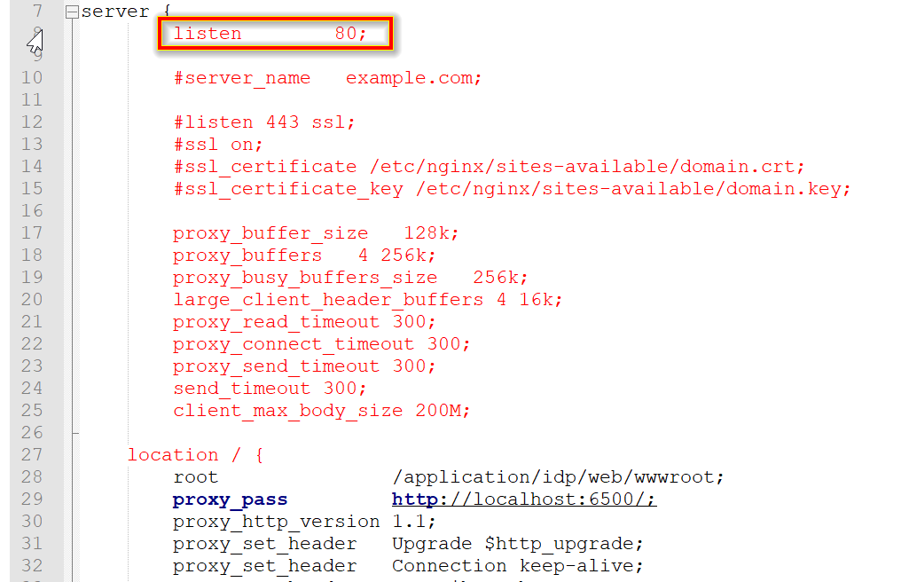
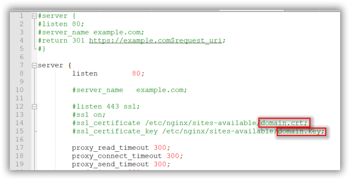

## SSL configuration in Nginx

If you have an SSL certificate for your domain and need to configure the site with your SSL certificate, follow these steps:

1. Uncomment the following marked lines in the **boldbi-nginx-config** file.

    
    
    
    
2. Comment the following marked line in the **boldbi-nginx-config** file.
    
    

3. Replace the example.com with your domain name.

4. Place the certificate and key file in your host directory, which you mounted on the Bold BI application to store Nginx configuration. i.e. The directory path replaced with `<host_path_for_nginx_config>` value in the advanced docker run command. You can update the certificate and key file names in **boldbi-nginx-config** file.
    
    

    > **NOTE:** If you are configuring the application with SSL, then you need to update the `<app_base_url>` in docker run command with `HTTPS`.